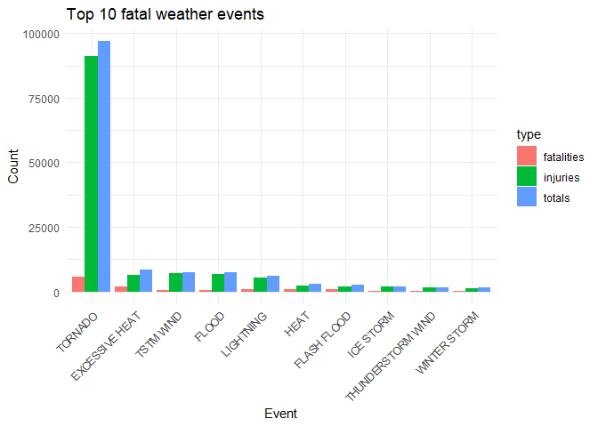
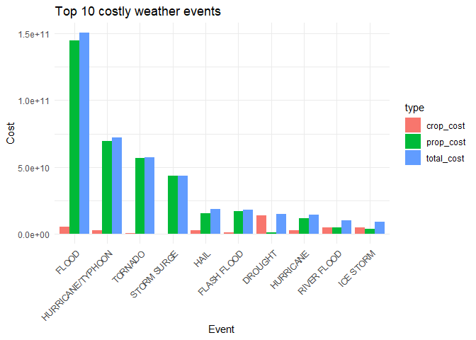

## 1: Synopsis
Here we explore the NOAA database of severe weather events to find those that are most harmful on: 

1. Health (injuries and deaths)
2. Property and crop

Information on the data can be obtained from this [documentation](https://d396qusza40orc.cloudfront.net/repdata%2Fpeer2_doc%2Fpd01016005curr.pdf)

## 2: Data Processing

### 2.1: Data Loading

Download the raw data file and extract into a data frame. Also initiate necessary libraries  

```r
library(ggplot2)
library(tidyr)
library(dplyr)
```

```
## 
## Attaching package: 'dplyr'
```

```
## The following objects are masked from 'package:stats':
## 
##     filter, lag
```

```
## The following objects are masked from 'package:base':
## 
##     intersect, setdiff, setequal, union
```

```r
url <- "https://d396qusza40orc.cloudfront.net/repdata%2Fdata%2FStormData.csv.bz2"
download.file(url, destfile = "storm_data.csv")
storm_dt <- read.csv("storm_data.csv")
```

### 2.2 Data subsetting

Firstly, we shallowly explore the data by looking at the column names.  

```r
colnames(storm_dt)
```

```
##  [1] "STATE__"    "BGN_DATE"   "BGN_TIME"   "TIME_ZONE"  "COUNTY"    
##  [6] "COUNTYNAME" "STATE"      "EVTYPE"     "BGN_RANGE"  "BGN_AZI"   
## [11] "BGN_LOCATI" "END_DATE"   "END_TIME"   "COUNTY_END" "COUNTYENDN"
## [16] "END_RANGE"  "END_AZI"    "END_LOCATI" "LENGTH"     "WIDTH"     
## [21] "F"          "MAG"        "FATALITIES" "INJURIES"   "PROPDMG"   
## [26] "PROPDMGEXP" "CROPDMG"    "CROPDMGEXP" "WFO"        "STATEOFFIC"
## [31] "ZONENAMES"  "LATITUDE"   "LONGITUDE"  "LATITUDE_E" "LONGITUDE_"
## [36] "REMARKS"    "REFNUM"
```

Observedly, we only need to keep columns relevant to our analysis, which are the event type, health and economic ones

```r
cols_to_keep <- c("EVTYPE", "FATALITIES", "INJURIES", "PROPDMG", "PROPDMGEXP", "CROPDMG", "CROPDMGEXP")
```

Now we subset the data to include just those columns, as well as events that had damaging consequences. Reformat some columns for more alignment 

```r
storm_dt <- storm_dt[cols_to_keep]
storm_dt <- storm_dt %>% 
    filter(EVTYPE != "?" | FATALITIES > 0 | INJURIES > 0 | PROPDMG > 0 | CROPDMG > 0) %>%
    mutate(CROPDMGEXP = toupper(CROPDMGEXP), PROPDMGEXP = toupper(PROPDMGEXP))
```

### 2.3: Convert alphanumeric component to values
Since the data given to us contains characters to represent the impact of events on property and crop, we need a method to turn it into real values


```r
PROPDMGMultiplier <-  c("\"\"" = 10^0,
                 "-" = 10^0, 
                 "+" = 10^0,
                 "0" = 10^0,
                 "1" = 10^1,
                 "2" = 10^2,
                 "3" = 10^3,
                 "4" = 10^4,
                 "5" = 10^5,
                 "6" = 10^6,
                 "7" = 10^7,
                 "8" = 10^8,
                 "9" = 10^9,
                 "H" = 10^2,
                 "K" = 10^3,
                 "M" = 10^6,
                 "B" = 10^9)

CROPDMGMultiplier <-  c("\"\"" = 10^0,
                 "?" = 10^0, 
                 "0" = 10^0,
                 "K" = 10^3,
                 "M" = 10^6,
                 "B" = 10^9)
storm_dt <- storm_dt %>% 
    mutate(CROPDMGEXP = CROPDMGMultiplier[CROPDMGEXP]) %>%
    mutate(PROPDMGEXP = PROPDMGMultiplier[PROPDMGEXP])
```

### 2.4: Calculate cost
Process missing data and calculate real cost.

```r
storm_dt$CROPDMGEXP <- ifelse(is.na(storm_dt$CROPDMGEXP), 1, storm_dt$CROPDMGEXP)
storm_dt$PROPDMGEXP <- ifelse(is.na(storm_dt$PROPDMGEXP), 1, storm_dt$PROPDMGEXP)
storm_dt <- storm_dt %>%
    mutate(prop_cost = PROPDMG * PROPDMGEXP, crop_cost = CROPDMG * CROPDMGEXP)
```

### 2.5: Measure impact
We summarise the data to obtain the impact on health and economy


```r
economy_damage <- storm_dt %>% 
    group_by(EVTYPE = as.factor(EVTYPE)) %>%
    summarise(prop_cost = sum(prop_cost), crop_cost = sum(crop_cost), 
              total_cost = sum(prop_cost) + sum(crop_cost)) %>%
    arrange(desc(total_cost))

human_damage <- storm_dt %>% 
    group_by(EVTYPE = as.factor(EVTYPE)) %>%
    summarise(fatalities = sum(FATALITIES), injuries = sum(INJURIES), 
              totals = sum(FATALITIES) + sum(INJURIES)) %>%
    arrange(desc(totals))
```

Retrieve the first 10 elements for plotting purposes, reshape for easier manipulation.

```r
health_suffering <- human_damage[1:10,]
econ_suffering <- economy_damage[1:10,]

health_suffering <- health_suffering %>% gather(key = type, value = value, - EVTYPE)
econ_suffering <- econ_suffering %>% gather(key = type, value = value, - EVTYPE)
```

## 3: Results

### 3.1: Most harmful events to health


```r
health_suffering %>% 
    ggplot(aes(x = reorder(EVTYPE, -value), y = value)) + 
    geom_bar(stat = "identity", aes(fill = type), position = "dodge") +
    labs(title = "Top 10 fatal weather events", x = "Event", y = "Count") +
    theme_minimal() + 
    theme(axis.text.x = element_text(angle = 45, hjust = 1), 
          plot.title.position = "panel")
```

<!-- -->

### 3.2: Most harmful events to economy

```r
econ_suffering %>% 
    ggplot(aes(x = reorder(EVTYPE, -value), y = value)) + 
    geom_bar(stat = "identity", aes(fill = type), position = "dodge") +
    labs(title = "Top 10 costly weather events", x = "Event", y = "Cost") +
    theme_minimal() + 
    theme(axis.text.x = element_text(angle = 45, hjust = 1), 
          plot.title.position = "panel")
```

<!-- -->
